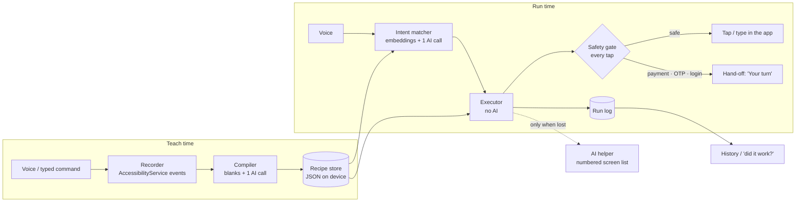
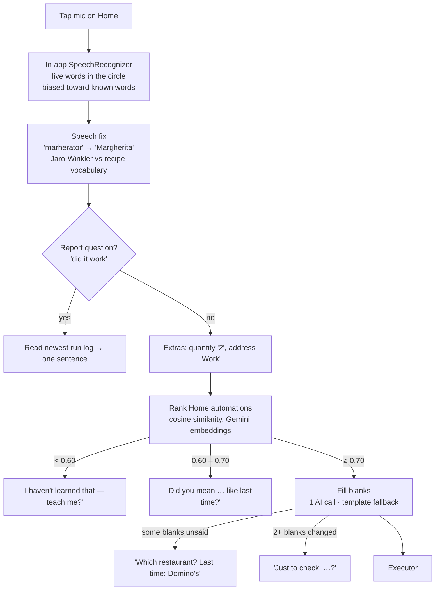
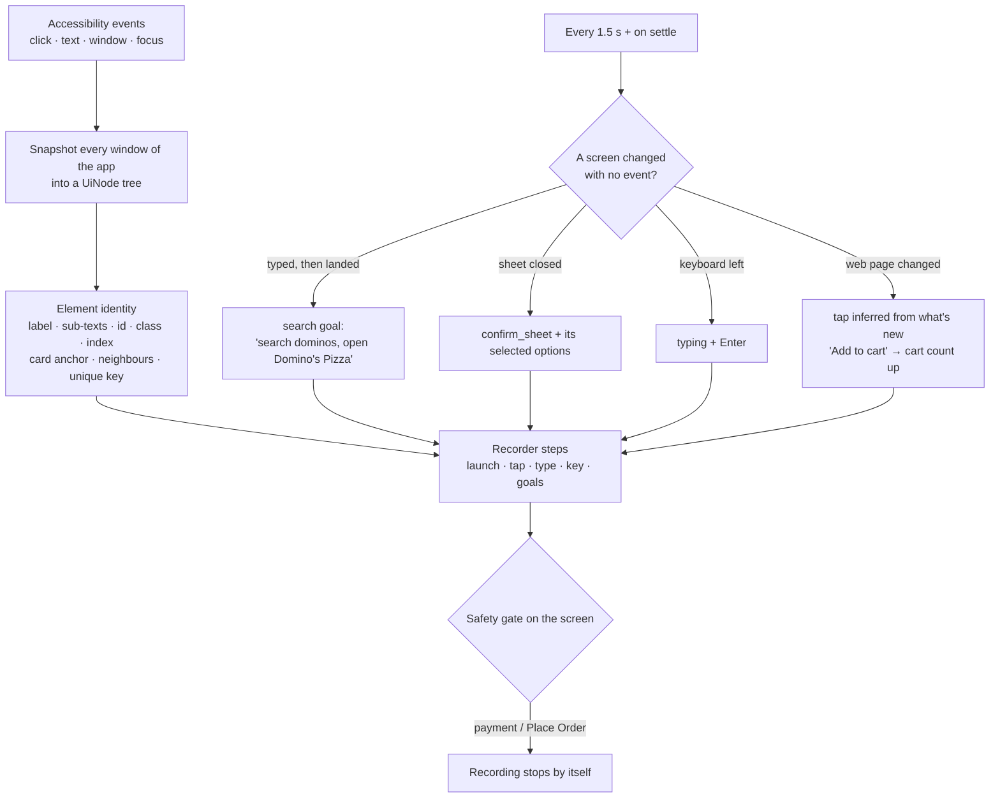
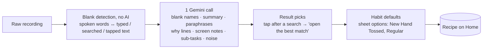
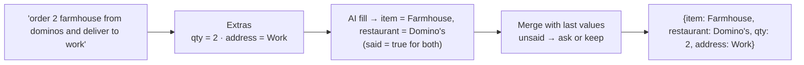
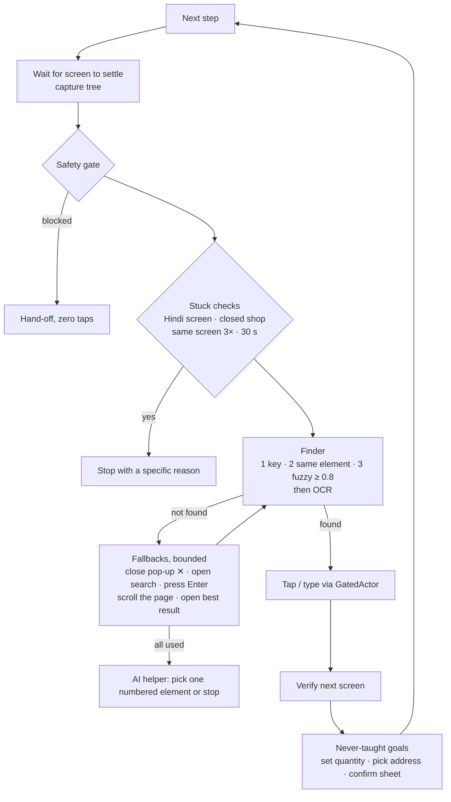

# MYNA architecture

MYNA has two phases. **Teach time** turns one demo into a recipe. **Run time** turns a spoken command into a replay of that recipe. A safety gate sits in front of every tap. AI is used for learning, understanding commands and last-resort recovery — never on the normal replay path.

## 1. The big picture

## 2. Speech → intent

Thresholds are VASTA's, re-measured on `gemini-embedding-001`: paraphrases score 0.75–0.88, *"Order pizza"* 0.68, unrelated commands ≤ 0.53.

## 3. UI-tree capture (recording a demo)

Why so much inference: real apps hide taps. Zomato's search suggestions are text-less Compose rows, its **Add item** button is a blank drawn box, and Amazon's product pages are web views — none of them send a click event.

## 4. Generalisation (compiling a recipe)

Example: *"Order a Margherita pizza from Domino's on Zomato"* → `{item}` = Margherita (typed in the menu search + the card the Add button sits on), `{restaurant}` = Domino's (the search + the result opened). Tapped-but-unsaid choices stay fixed as habit defaults.

## 5. Blank (slot) extraction at run time

## 6. Replay

## 7. Safety gate (T11)

Rules only, no AI. Checked on every settled screen and before every tap or typed character.

| Blocks | How it's detected |
|---|---|
| Credentials | password fields; fields asking for OTP, CVV, card number, UPI PIN |
| Payment | known payment apps; 3+ payment-method kinds on screen (UPI, card, net banking, wallet, COD, EMI), or 2 with payment radio buttons |
| Final order | any tappable *Place Order / Pay ₹ / Proceed to pay*, or a button that leads into payment (*Add / Select payment method*) |
| Login | a text field plus a *Log in / Send OTP / Verify* button |

Tuned on real screens: a cart advertising card offers, Amazon's "Wallet" tab and product pages with colour radios are **not** payment screens. The single exception: on a *Place Order* screen (never a payment or credential screen) MYNA may use the **address picker** for "deliver to Work"; the Place Order button itself stays blocked. In practice the address is switched earlier, right after the app opens, from its home header ("Home ▾ …" → saved addresses → Work); an address the app says it can't deliver to stops the run with that reason. `GatedActor` is the only code allowed to tap or type in another app.

## 8. Where things live

| Module | Files |
|---|---|
| Accessibility service, tree capture | `a11y/MynaService.kt`, `a11y/UiTree.kt` |
| Recorder | `record/Recorder.kt`, `screen/Identity.kt` |
| Compiler | `compile/Compiler.kt` |
| Intent matcher | `intent/IntentMatcher.kt`, `intent/SpeechFix.kt`, `intent/Extras.kt` |
| Replay | `replay/Executor.kt`, `replay/Finder.kt`, `replay/RunLog.kt`, `replay/Privacy.kt` |
| Safety | `safety/SafetyGate.kt`, `safety/GatedActor.kt` |
| AI client | `llm/Llm.kt`, `llm/JsonSchema.kt` |
